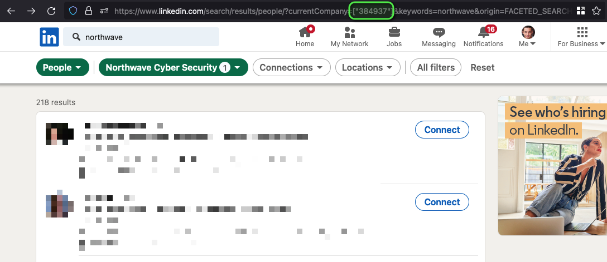

<p align="center">
    
</p>
<p align="center">
    <a href="LICENSE"></a>
</p>
<p align="center">
    <b>Obtain employee names and email addresses based on LinkedIn data</b>
    <br/>
    <a href="#goal">Goal</a>
    •
    <a href="#installation">Installation</a>
    •
    <a href="#usage">Usage</a>
    •
    <a href="#issues">Issues</a>
    •
    <a href="#license">License</a>
    <br/>
    <sub>Built with ❤ by the <a href="https://twitter.com/NorthwaveLabs">Northwave</a> Red Team</sub>
    <br/>
</p>

<hr>

## Goal

Obtain employee names and email addresses based on LinkedIn data.

## Installation

```
pip install git+https://github.com/NorthwaveSecurity/linkedin-crawler
```

or 

```
make install
```

## Usage

Copy `settings.example.toml` to `settings.toml` and set the cookie values based on the values of a logged-in browser session.
You can also install a settings file in ~/.config/linkedin_crawler/settings.toml

Search for a company's employees on LinkedIn and copy the company ID from the URL:



```
linkedin_crawler <company_id> <email_domain>
linkedin_crawler --help
```

### Tests

```
make tests
```

## Issues

Issues or new features can be reported via the [Github issue tracker](https://github.com/NorthwaveSecurity/linkedin-crawler/issues). Please make sure your issue or feature has not yet been reported by anyone else before submitting a new one.

## License

LinkedIn Crawler is open-sourced software licensed under the [MIT license](LICENSE).

